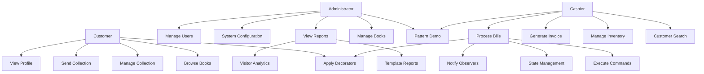
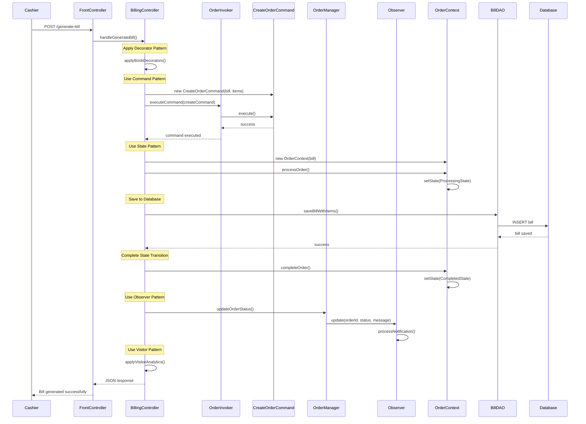

# Part A - Project Documentation

## Table of Contents
1. [Introduction](#1-introduction)
   - 1.1 [Aim for this project](#11-aim-for-this-project)
   - 1.2 [UML Diagram](#12-uml-diagram)
     - 1.2.1 [Use-case diagram](#121-use-case-diagram)
     - 1.2.2 [Class diagram](#122-class-diagram)
     - 1.2.3 [Sequence diagram](#123-sequence-diagram)
   - 1.3 [System Development](#13-system-development)

---

## 1. Introduction

The BookShop Billing System is a comprehensive Java web application designed to demonstrate enterprise-level software architecture through the implementation of multiple design patterns. This project serves as both a functional billing system for Pahana Edu and an educational showcase of professional software design principles.

### 1.1 Aim for this project

**Primary Objectives:**
- Implement a complete billing system for bookstore operations
- Demonstrate mastery of 12 major design patterns in a real-world application
- Create a scalable, maintainable enterprise-level Java web application
- Provide an interactive educational platform for understanding design patterns

**Specific Goals:**
1. **Pattern Implementation**: Successfully integrate Singleton, Strategy, Factory, Builder, Command, Observer, State, Decorator, Template, Visitor, MVC, and DAO patterns
2. **Functional System**: Develop a complete billing system with user management, inventory control, customer store, and reporting capabilities
3. **Educational Value**: Create interactive demonstrations and comprehensive documentation for each design pattern
4. **Customer Experience**: Implement book browsing, collection management, and admin communication features
5. **Production Quality**: Implement security, error handling, and performance optimization suitable for enterprise deployment

**Target Users:**
- **Administrators**: Complete system management and configuration
- **Cashiers**: Billing operations and inventory management
- **Customers**: Book browsing, collection management, and purchase history
- **Developers/Students**: Learning design pattern implementation

### 1.2 UML Diagram

#### 1.2.1 Use-case diagram



**Use Case Descriptions:**

| Use Case | Actor | Description | Design Patterns Used |
|----------|-------|-------------|---------------------|
| UC1 - Manage Users | Admin | Create, update, delete user accounts | DAO, Factory |
| UC2 - System Configuration | Admin | Configure system settings and parameters | Singleton |
| UC3 - View Reports | Admin/Cashier | Generate and view various reports | Template, Visitor |
| UC4 - Manage Books | Admin | Add, edit, delete books from inventory | DAO, Builder |
| UC5 - Pattern Demo | Admin/Cashier | Interactive design pattern demonstration | All Patterns |
| UC6 - Process Bills | Cashier | Create bills with multiple items | Command, State, Observer, Decorator |
| UC7 - Generate Invoice | Cashier | Create printable invoices | Builder, Template |
| UC8 - Manage Inventory | Cashier | Update stock levels and book information | Observer, DAO |
| UC9 - Customer Search | Cashier | Search and select customers for billing | Strategy |
| UC10 - Browse Books | Customer | View available books and build collections | MVC, DAO |
| UC11 - Manage Collection | Customer | Add/remove books, send to admin | Observer, Command |
| UC12 - Send Collection | Customer | Email collection requests to admin | Template, Observer |

#### 1.2.2 Class diagram

```mermaid
classDiagram
    %% Core Model Classes
    class User {
        -int id
        -String username
        -String password
        -String email
        -String role
        -String fullName
        -String phone
        +getId() int
        +setUsername(String)
        +authenticate() boolean
    }
    
    class Book {
        -int id
        -String title
        -String author
        -String isbn
        -double price
        -int quantity
        -String category
        +getPrice() double
        +updateQuantity(int)
    }
    
    class Bill {
        -int id
        -String billNumber
        -Date billDate
        -User customer
        -User cashier
        -double subtotal
        -double discount
        -double tax
        -double total
        -String paymentMethod
        -String status
        +calculateTotal() double
        +addItem(BillItem)
    }
    
    class BillItem {
        -int id
        -Bill bill
        -Book book
        -int quantity
        -double unitPrice
        -double total
        +calculateItemTotal() double
    }
    
    %% Design Pattern Classes
    class DBConnection {
        -static DBConnection instance
        -Connection connection
        +static getInstance() DBConnection
        +getConnection() Connection
    }
    
    class PaymentStrategy {
        <<interface>>
        +processPayment(double) boolean
    }
    
    class CashPayment {
        +processPayment(double) boolean
    }
    
    class CardPayment {
        +processPayment(double) boolean
    }
    
    class OrderCommand {
        <<interface>>
        +execute() boolean
        +undo() boolean
        +getDescription() String
    }
    
    class CreateOrderCommand {
        -Bill order
        -List~Object~ orderItems
        +execute() boolean
        +undo() boolean
    }
    
    class OrderInvoker {
        -Stack~OrderCommand~ commandHistory
        +executeCommand(OrderCommand) boolean
        +undoLastCommand() boolean
    }
    
    class OrderObserver {
        <<interface>>
        +update(int, String, String)
        +getObserverId() String
    }
    
    class InventoryObserver {
        +update(int, String, String)
    }
    
    class OrderManager {
        -static OrderManager instance
        -List~OrderObserver~ observers
        +registerObserver(OrderObserver)
        +notifyObservers(int, String, String)
    }
    
    class OrderState {
        <<interface>>
        +processOrder(OrderContext)
        +cancelOrder(OrderContext)
        +completeOrder(OrderContext)
    }
    
    class OrderContext {
        -OrderState currentState
        -Bill order
        +setState(OrderState)
        +processOrder()
        +cancelOrder()
        +completeOrder()
    }
    
    class BookDecorator {
        <<interface>>
        +getDecoratedPrice() double
        +getDecoratedTitle() String
        +applyDecoration()
    }
    
    class PremiumBookDecorator {
        -Book book
        -String premiumFeature
        +getDecoratedPrice() double
        +applyDecoration()
    }
    
    %% Controllers
    class BillingController {
        -OrderInvoker orderInvoker
        -OrderManager orderManager
        +handleGenerateBill(HttpServletRequest, HttpServletResponse)
        +handlePatternDemo(HttpServletRequest, HttpServletResponse)
        +applyBookDecorators(List~CartItem~) List~CartItem~
    }
    
    class BookController {
        +handleBooks(HttpServletRequest, HttpServletResponse)
        +handleStore(HttpServletRequest, HttpServletResponse)
        +handleSearchBooks(HttpServletRequest, HttpServletResponse)
        +filterBooks(List~Book~, String) List~Book~
    }
    
    class FrontControllerServlet {
        -AuthController authController
        -BookController bookController
        -BillingController billingController
        -CustomerController customerController
        +processRequest(HttpServletRequest, HttpServletResponse)
        +routeRequest(String, HttpServletRequest, HttpServletResponse)
        +handleSendCollection(HttpServletRequest, HttpServletResponse)
    }
    
    class Collection {
        -List~Book~ books
        -String customerNote
        -String customerEmail
        +addBook(Book)
        +removeBook(Book)
        +sendToAdmin() boolean
    }
    
    %% Relationships
    User ||--o{ Bill : customer
    User ||--o{ Bill : cashier
    Bill ||--o{ BillItem : contains
    Book ||--o{ BillItem : references
    
    DBConnection --> DBConnection : singleton
    PaymentStrategy <|-- CashPayment
    PaymentStrategy <|-- CardPayment
    
    OrderCommand <|-- CreateOrderCommand
    OrderInvoker --> OrderCommand : executes
    
    OrderObserver <|-- InventoryObserver
    OrderManager --> OrderObserver : notifies
    
    OrderState <|-- PendingState
    OrderState <|-- ProcessingState
    OrderContext --> OrderState : manages
    
    BookDecorator <|-- PremiumBookDecorator
    PremiumBookDecorator --> Book : decorates
    
    BillingController --> OrderInvoker : uses
    BillingController --> OrderManager : uses
    FrontControllerServlet --> BillingController : routes
    FrontControllerServlet --> BookController : routes
    BookController --> Book : manages
    Collection --> Book : contains
    User ||--o{ Collection : creates
```

#### 1.2.3 Sequence diagram



**Sequence Flow Description:**

1. **Request Initiation**: Cashier submits bill generation request
2. **Decorator Application**: Books are enhanced with premium features or discounts
3. **Command Execution**: Order creation command is executed with undo capability
4. **State Management**: Order transitions through defined states
5. **Data Persistence**: Bill and items are saved to database
6. **Observer Notification**: All registered observers are notified of status changes
7. **Analytics Collection**: Visitor pattern collects sales data
8. **Response**: Success confirmation returned to user

### 1.3 System Development

**Development Methodology:**
- **Approach**: Agile development with pattern-driven design
- **Architecture**: Layered architecture with MVC pattern
- **Technology Stack**: Java 17, Jakarta EE 10, MySQL 8.0, Apache Tomcat 11

**Development Phases:**

1. **Phase 1 - Foundation Setup**
   - Project structure creation
   - Database design and setup
   - Basic MVC architecture implementation
   - Core model classes development

2. **Phase 2 - Basic Patterns Implementation**
   - Singleton pattern for database connections
   - DAO pattern for data access
   - Strategy pattern for payment methods
   - Factory pattern for discount types

3. **Phase 3 - Advanced Patterns Integration**
   - Command pattern for order operations
   - Observer pattern for notifications
   - State pattern for order lifecycle
   - Decorator pattern for book enhancement

4. **Phase 4 - Customer Experience Features**
   - Customer store interface development
   - Collection management with localStorage
   - AJAX-based admin communication
   - Responsive design implementation

5. **Phase 5 - Reporting and Analytics**
   - Template pattern for report generation
   - Visitor pattern for sales analytics
   - Builder pattern for complex object construction

6. **Phase 6 - Integration and Testing**
   - Pattern integration in billing workflow
   - Interactive demonstration interface
   - Store and collection functionality testing
   - Comprehensive testing and debugging
   - Documentation and deployment

**Key Development Decisions:**

| Decision | Rationale | Impact |
|----------|-----------|---------|
| Jakarta EE 10 | Modern enterprise standards | Future-proof architecture |
| Modular Controllers | Single responsibility principle | Better maintainability |
| Pattern Integration | Real-world application | Educational and practical value |
| Interactive Demo | Learning facilitation | Enhanced user experience |
| RESTful APIs | System integration capability | Scalability and flexibility |
| localStorage Collections | Client-side persistence | Improved user experience |
| AJAX Communication | Seamless admin interaction | Modern web application feel |

**Quality Assurance Measures:**
- Code reviews and pattern validation
- Security implementation (authentication, authorization)
- Performance optimization
- Comprehensive error handling
- Responsive UI design
- Cross-browser compatibility testing

This systematic development approach ensured the successful implementation of all 12 design patterns while maintaining code quality, performance, and educational value.