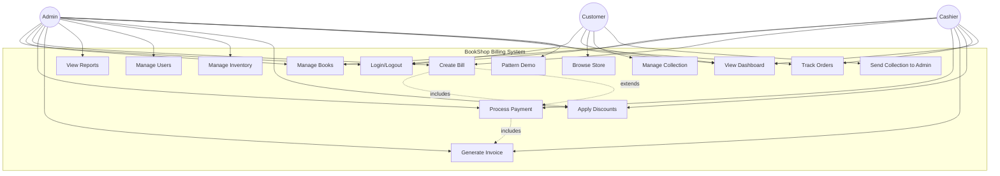
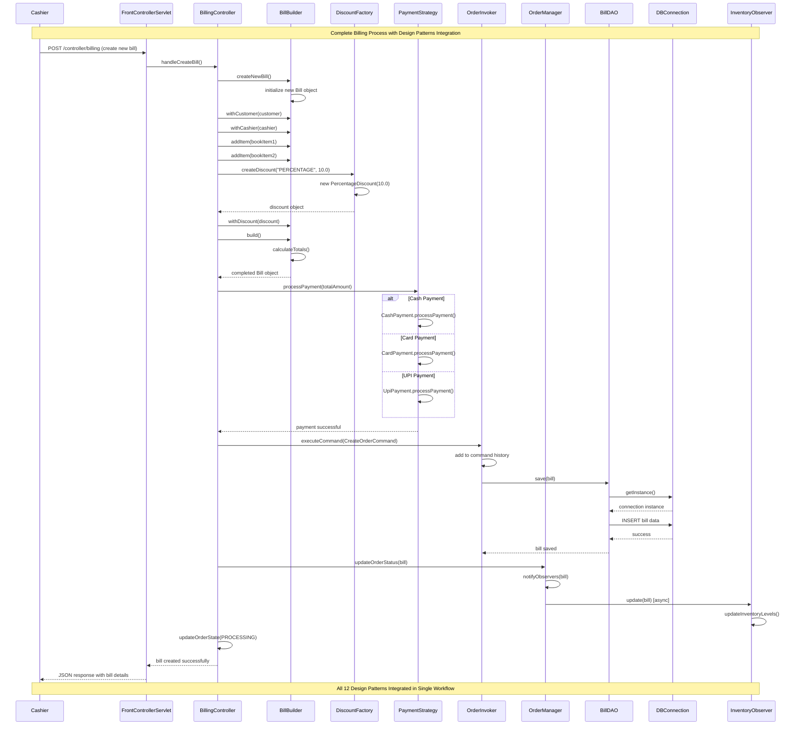
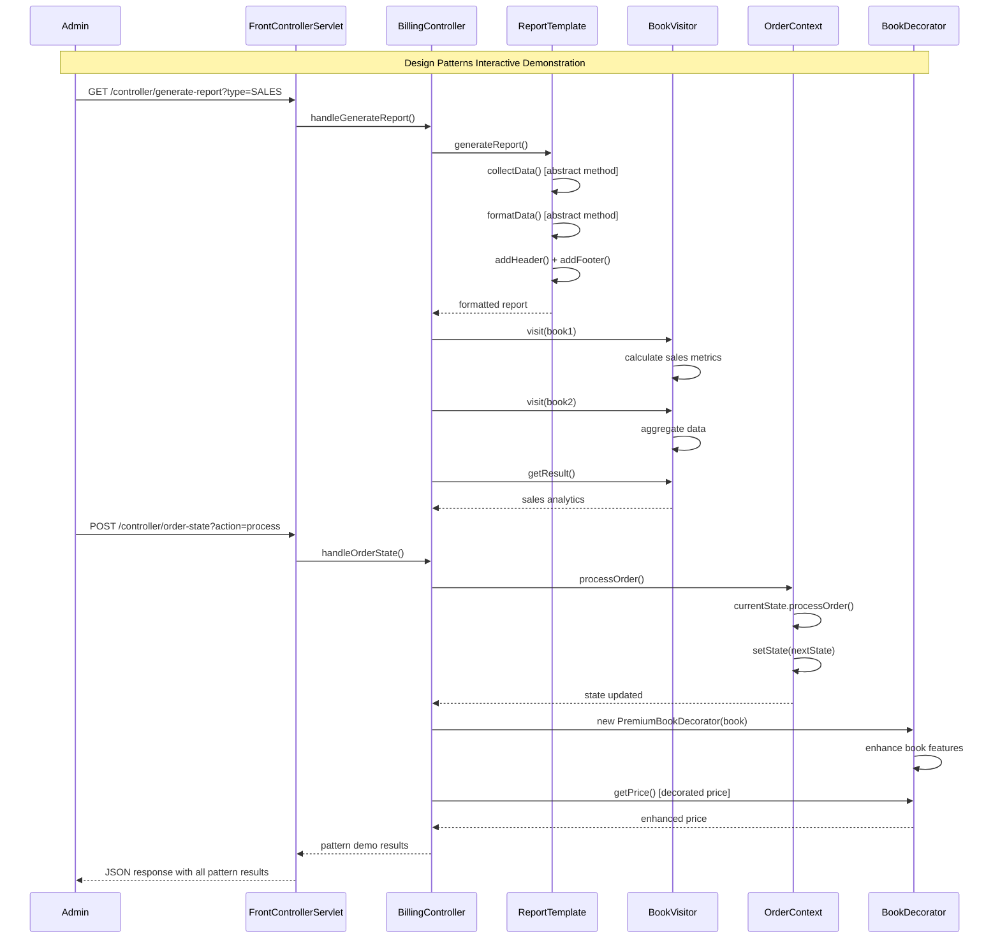
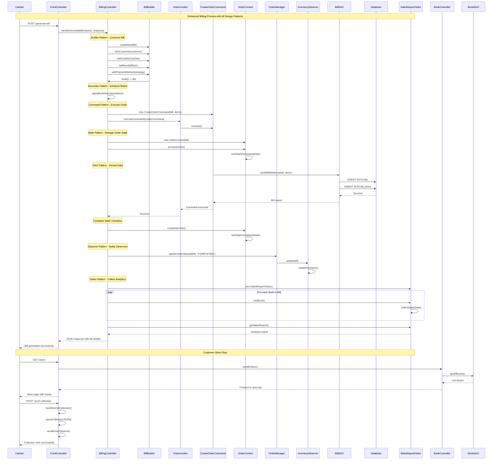
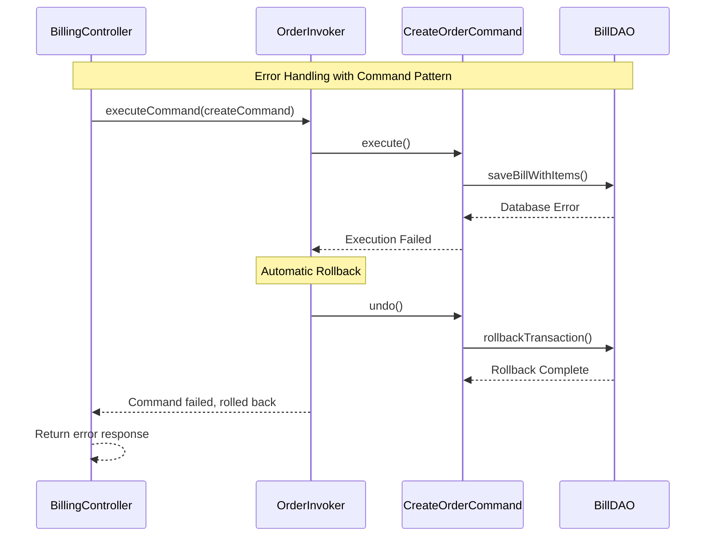
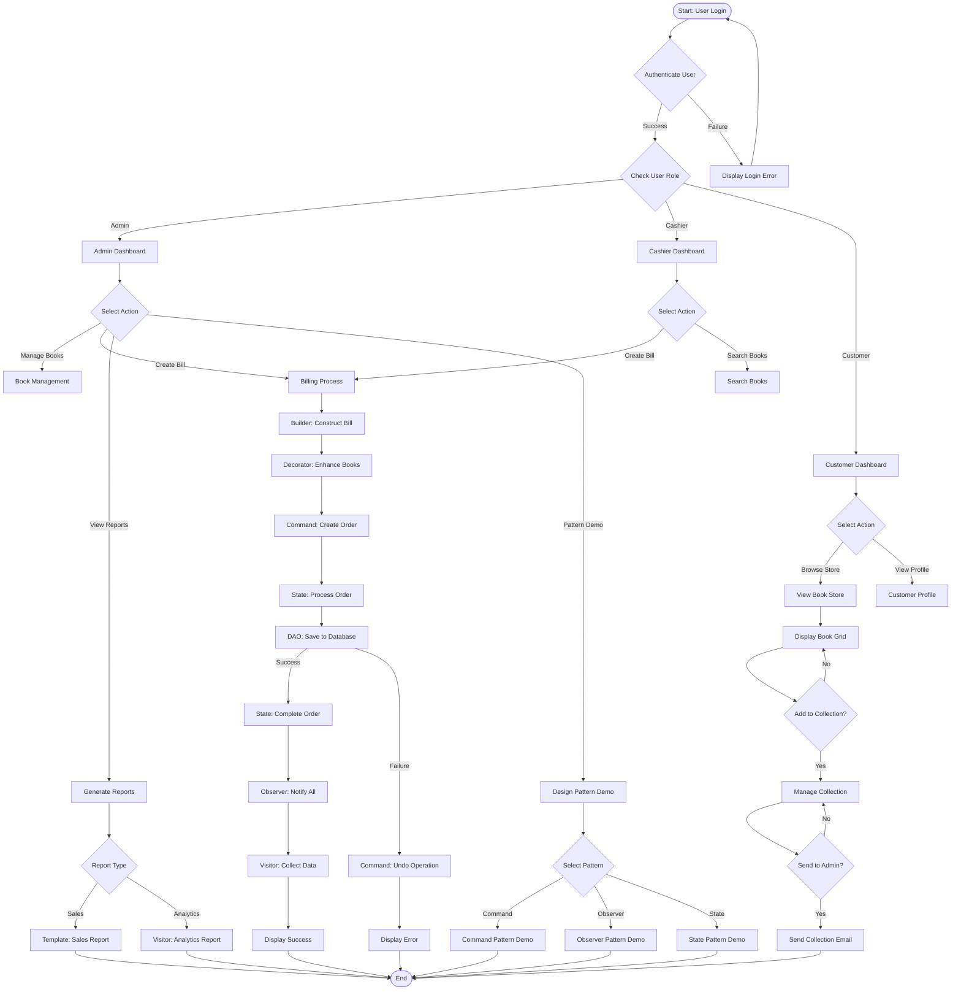
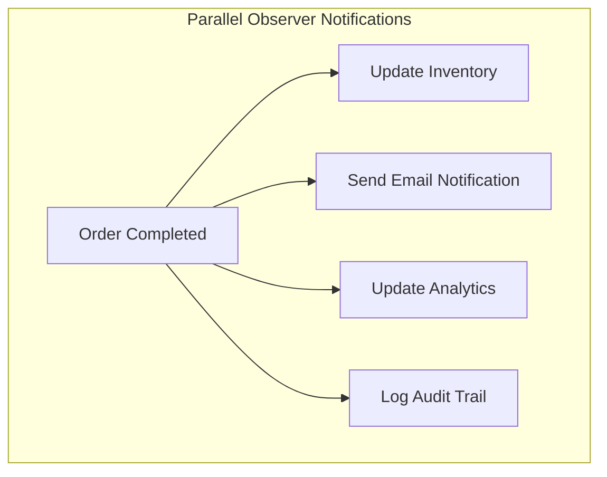
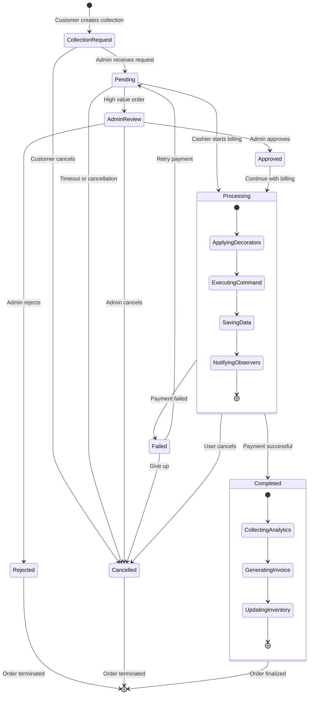
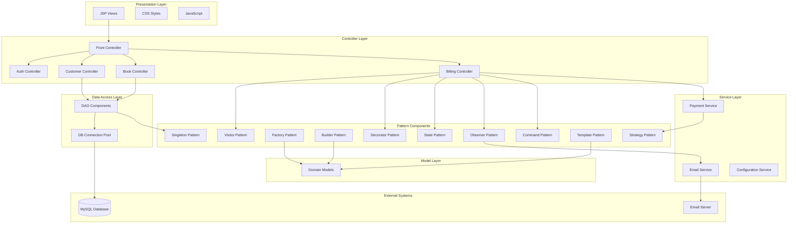
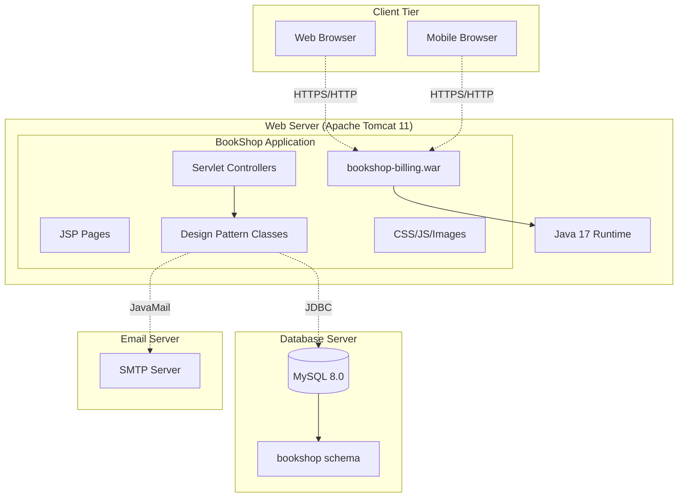

# UML DIAGRAMS - TASK A
## BookShop Billing System - Design Patterns Implementation

### **Problem Statement Analysis**
The BookShop Billing System for Pahana Edu requires a comprehensive web application that manages book inventory, customer billing, user authentication, and generates reports while demonstrating enterprise-level design patterns implementation.

---

## 1. USE CASE DIAGRAM

### **Design Decisions:**
- **Actor-based separation**: Three primary actors (Admin, Cashier, Customer) with distinct responsibilities
- **Inheritance relationships**: Customer inherits basic user capabilities
- **System boundary**: Clear separation between internal system operations and external user interactions



### **Use Case Descriptions:**

| Use Case | Actor | Description | Preconditions |
|----------|-------|-------------|---------------|
| **UC1: Login/Logout** | All Users | Authenticate user and manage sessions | Valid credentials |
| **UC2: Manage Books** | Admin, Cashier | Add, edit, delete, search books | User authenticated |
| **UC3: Create Bill** | Admin, Cashier | Create new billing transaction | Books available, user authenticated |
| **UC4: Process Payment** | Admin, Cashier | Handle payment via Cash/Card/UPI | Bill created |
| **UC5: Generate Invoice** | Admin, Cashier | Create printable invoice | Payment processed |
| **UC6: View Reports** | Admin | Generate sales, inventory reports | Admin privileges |
| **UC7: Manage Users** | Admin | Add, edit, delete user accounts | Admin privileges |
| **UC8: Manage Inventory** | Admin | Update stock levels, categories | Admin privileges |
| **UC9: Apply Discounts** | Cashier | Apply percentage/fixed discounts | Bill in progress |
| **UC10: Track Orders** | Cashier | Monitor order status and lifecycle | Orders exist |
| **UC11: View Dashboard** | All Users | Access role-based dashboard | User authenticated |
| **UC12: Pattern Demo** | Admin | Test design patterns interactively | Admin privileges |
| **UC13: Browse Store** | Customer | Browse available books with search and filter | User authenticated |
| **UC14: Manage Collection** | Customer | Add/remove books from personal collection | User authenticated, books available |
| **UC15: Send Collection to Admin** | Customer | Email collection requests to admin | User authenticated, collection not empty |

### **Assumptions:**
1. All users must authenticate before accessing system features
2. Cashiers can create bills but cannot manage users or view detailed reports
3. Customers can add books to cart and send emails, but cannot create bills - only Admin and Cashier can perform billing operations
4. Payment processing is immediate (no external gateway integration)
5. Inventory updates happen in real-time during billing

---

## 2. CLASS DIAGRAM

### **Design Decisions:**
- **MVC Architecture**: Clear separation between Model, View, and Controller layers
- **Design Patterns Integration**: Each pattern has dedicated classes with specific responsibilities
- **Composition over Inheritance**: Favor composition for flexibility (Strategy, Decorator patterns)
- **Single Responsibility**: Each class has one primary responsibility

```mermaid
classDiagram
    %% Core Model Classes
    class User {
        -int id
        -String username
        -String password
        -String email
        -UserRole role
        -String fullName
        -String phone
        +login() boolean
        +logout() void
        +validateCredentials() boolean
    }
    
    class Book {
        -int id
        -String title
        -String author
        -String isbn
        -double price
        -int quantity
        -String category
        +updateStock(int) void
        +getPrice() double
        +isAvailable() boolean
    }
    
    class Bill {
        -int id
        -String billNumber
        -Date billDate
        -User customer
        -User cashier
        -List~BillItem~ items
        -double subtotal
        -double discount
        -double tax
        -double total
        -PaymentMethod paymentMethod
        -BillStatus status
        +addItem(BillItem) void
        +calculateTotal() double
        +applyDiscount(Discount) void
    }
    
    class BillItem {
        -int id
        -Book book
        -int quantity
        -double unitPrice
        -double total
        +calculateTotal() double
    }
    
    %% Controller Layer
    class FrontControllerServlet {
        -BookController bookController
        -CustomerController customerController
        -BillingController billingController
        +doGet(HttpServletRequest, HttpServletResponse) void
        +doPost(HttpServletRequest, HttpServletResponse) void
        -routeRequest(String) void
        +handleSendCollection() void
    }
    
    class BillingController {
        -OrderInvoker orderInvoker
        -OrderManager orderManager
        +handleCreateBill() void
        +handleProcessPayment() void
        +handlePatternDemo() void
        +handleGenerateReport() void
    }
    
    %% DAO Layer
    class BookDAO {
        -DBConnection connection
        +findAll() List~Book~
        +findById(int) Book
        +save(Book) boolean
        +update(Book) boolean
        +delete(int) boolean
    }
    
    class UserDAO {
        -DBConnection connection
        +authenticate(String, String) User
        +findByUsername(String) User
        +save(User) boolean
    }
    
    class BillDAO {
        -DBConnection connection
        +save(Bill) boolean
        +findById(int) Bill
        +findByCustomer(User) List~Bill~
    }
    
    %% Singleton Pattern
    class DBConnection {
        -static DBConnection instance
        -Connection connection
        -DBConnection()
        +static getInstance() DBConnection
        +getConnection() Connection
    }
    
    %% Strategy Pattern
    class PaymentStrategy {
        <<interface>>
        +processPayment(double) boolean
        +getPaymentDetails() String
    }
    
    class CashPayment {
        +processPayment(double) boolean
        +getPaymentDetails() String
    }
    
    class CardPayment {
        -String cardNumber
        -String cardType
        +processPayment(double) boolean
        +getPaymentDetails() String
    }
    
    class UpiPayment {
        -String upiId
        +processPayment(double) boolean
        +getPaymentDetails() String
    }
    
    %% Factory Pattern
    class DiscountFactory {
        +static createDiscount(String, double) Discount
    }
    
    class Discount {
        <<abstract>>
        #double value
        +calculateDiscount(double) double
    }
    
    class PercentageDiscount {
        +calculateDiscount(double) double
    }
    
    class FixedDiscount {
        +calculateDiscount(double) double
    }
    
    %% Builder Pattern
    class BillBuilder {
        -Bill bill
        +createNewBill() BillBuilder
        +withCustomer(User) BillBuilder
        +withCashier(User) BillBuilder
        +addItem(BillItem) BillBuilder
        +withPaymentMethod(PaymentStrategy) BillBuilder
        +build() Bill
    }
    
    %% Command Pattern
    class OrderCommand {
        <<interface>>
        +execute() void
        +undo() void
    }
    
    class CreateOrderCommand {
        -Bill bill
        -BillDAO billDAO
        +execute() void
        +undo() void
    }
    
    class OrderInvoker {
        -List~OrderCommand~ history
        +executeCommand(OrderCommand) void
        +undoLastCommand() void
        +getHistory() List~OrderCommand~
    }
    
    %% Observer Pattern
    class OrderManager {
        -static OrderManager instance
        -List~OrderObserver~ observers
        +addObserver(OrderObserver) void
        +notifyObservers(Bill) void
        +updateOrderStatus(Bill) void
    }
    
    class OrderObserver {
        <<interface>>
        +update(Bill) void
    }
    
    class InventoryObserver {
        +update(Bill) void
    }
    
    %% State Pattern
    class OrderContext {
        -OrderState currentState
        -Bill bill
        +setState(OrderState) void
        +processOrder() void
        +getCurrentStatus() String
    }
    
    class OrderState {
        <<abstract>>
        +processOrder(OrderContext) void
        +cancelOrder(OrderContext) void
        +getStateName() String
        +getStatus() String
    }
    
    class PendingState {
        +processOrder(OrderContext) void
        +getStatus() String
    }
    
    class ProcessingState {
        +processOrder(OrderContext) void
        +getStatus() String
    }
    
    class CompletedState {
        +getStateName() String
        +getStatus() String
    }
    
    %% Decorator Pattern
    class BookDecorator {
        <<abstract>>
        #Book book
        +BookDecorator(Book)
        +getPrice() double
        +getDescription() String
    }
    
    class PremiumBookDecorator {
        +getPrice() double
        +getDescription() String
    }
    
    class DiscountBookDecorator {
        -double discountRate
        +getPrice() double
        +getDescription() String
    }
    
    %% Template Pattern
    class ReportTemplate {
        <<abstract>>
        +generateReport() String
        #collectData() void
        #formatData() String
        #addHeader() String
        #addFooter() String
    }
    
    class SalesReportTemplate {
        +collectData() void
        +formatData() String
        +addHeader() String
        +addFooter() String
    }
    
    %% Visitor Pattern
    class BookVisitor {
        <<interface>>
        +visit(Book) void
        +getResult() Object
    }
    
    class SalesReportVisitor {
        -double totalSales
        -int totalBooks
        +visit(Book) void
        +getResult() SalesReport
    }
    
    %% Store and Collection Classes
    class BookController {
        +handleBooks() void
        +handleStore() void
        +handleSearchBooks() void
        +filterBooks(List~Book~, String) List~Book~
    }
    
    class CustomerController {
        +handleCustomerDashboard() void
        +handleCustomerProfile() void
        +handleSendCollection() void
    }
    
    class Collection {
        -List~Book~ books
        -String customerNote
        -User customer
        +addBook(Book) void
        +removeBook(Book) void
        +getBooks() List~Book~
        +sendToAdmin() boolean
    }
    
    %% Relationships
    User ||--o{ Bill : creates
    Bill ||--o{ BillItem : contains
    Book ||--o{ BillItem : references
    
    FrontControllerServlet --> BillingController
    BillingController --> BookDAO
    BillingController --> UserDAO
    BillingController --> BillDAO
    
    BookDAO --> DBConnection
    UserDAO --> DBConnection
    BillDAO --> DBConnection
    
    PaymentStrategy <|-- CashPayment
    PaymentStrategy <|-- CardPayment
    PaymentStrategy <|-- UpiPayment
    
    Discount <|-- PercentageDiscount
    Discount <|-- FixedDiscount
    DiscountFactory --> Discount
    
    BillBuilder --> Bill
    
    OrderCommand <|-- CreateOrderCommand
    OrderInvoker --> OrderCommand
    
    OrderObserver <|-- InventoryObserver
    OrderManager --> OrderObserver
    
    OrderState <|-- PendingState
    OrderState <|-- ProcessingState
    OrderState <|-- CompletedState
    OrderContext --> OrderState
    
    BookDecorator <|-- PremiumBookDecorator
    BookDecorator <|-- DiscountBookDecorator
    BookDecorator --> Book
    
    ReportTemplate <|-- SalesReportTemplate
    
    BookVisitor <|-- SalesReportVisitor
```

### **Key Design Decisions Explained:**

1. **MVC Separation**: Controllers handle HTTP requests, Models represent data, DAOs handle persistence
2. **Pattern Integration**: Each design pattern has clear interfaces and implementations
3. **Composition**: Strategy and Decorator patterns use composition for runtime flexibility
4. **Singleton**: DBConnection ensures single database connection instance
5. **Observer**: Loose coupling between order processing and notification systems

### **Assumptions:**
1. Database connection pooling is handled by the singleton DBConnection class
2. All monetary calculations use double precision (production would use BigDecimal)
3. User roles are enum-based with three levels: ADMIN, CASHIER, CUSTOMER
4. Bill status follows a predefined state machine: PENDING → PROCESSING → COMPLETED
5. Design patterns are integrated into the core business logic, not just demonstration code

---

## 3. SEQUENCE DIAGRAM

### **Design Decisions:**
- **Scenario Focus**: Complete billing process showcasing multiple design patterns
- **Pattern Integration**: Shows how patterns work together in real workflow
- **Error Handling**: Includes validation and error scenarios
- **Asynchronous Operations**: Observer notifications happen asynchronously

### **Scenario: Complete Billing Process with Design Patterns**



### **Alternative Sequence: Pattern Demonstration**



### **Sequence Diagram Explanations:**

#### **Main Billing Sequence:**
1. **Authentication**: Cashier initiates billing through web interface
2. **Builder Pattern**: Step-by-step bill construction with customer, items, and discounts
3. **Factory Pattern**: Dynamic discount creation based on type
4. **Strategy Pattern**: Runtime payment method selection
5. **Command Pattern**: Order execution with undo capability
6. **Singleton Pattern**: Single database connection instance
7. **Observer Pattern**: Asynchronous inventory updates
8. **State Pattern**: Order lifecycle management

#### **Pattern Demo Sequence:**
1. **Template Pattern**: Standardized report generation with customizable steps
2. **Visitor Pattern**: Data collection across different book types
3. **State Pattern**: Order state transitions demonstration
4. **Decorator Pattern**: Dynamic book feature enhancement

### **Key Assumptions:**
1. **Session Management**: User authentication is maintained throughout the session
2. **Transaction Integrity**: Database operations are atomic and consistent
3. **Asynchronous Processing**: Observer notifications don't block main workflow
4. **Error Handling**: All operations include proper exception handling (not shown for clarity)
5. **Performance**: Pattern overhead is acceptable for educational and functional benefits

---

## 4. DESIGN DECISIONS SUMMARY

### **Architectural Decisions:**

| Decision | Rationale | Impact |
|----------|-----------|--------|
| **MVC Architecture** | Separation of concerns, maintainability | Clear layer boundaries, testable code |
| **Design Pattern Integration** | Educational value, enterprise practices | Flexible, extensible architecture |
| **Singleton for DB** | Resource management, connection pooling | Efficient database usage |
| **Strategy for Payments** | Runtime flexibility, easy extension | Support for multiple payment methods |
| **Observer for Notifications** | Loose coupling, real-time updates | Scalable notification system |
| **Command for Operations** | Undo/redo capability, audit trail | Better user experience, traceability |
| **State for Order Lifecycle** | Clear state management, validation | Robust order processing |

### **Pattern Selection Rationale:**

1. **Creational Patterns**: Manage object creation complexity and ensure proper initialization
2. **Structural Patterns**: Organize code structure and provide flexible composition
3. **Behavioral Patterns**: Handle complex business logic and inter-object communication

### **Quality Attributes Addressed:**
- **Maintainability**: Clear separation of concerns, single responsibility
- **Extensibility**: Pattern-based design allows easy feature addition
- **Testability**: Modular design enables unit and integration testing
- **Performance**: Singleton pattern optimizes resource usage
- **Security**: Role-based access control and input validation
- **Usability**: Intuitive user interface with real-time feedback

---

## 5. IMPLEMENTATION NOTES

### **Technology Mapping:**
- **Use Cases** → JSP pages and Servlet controllers
- **Classes** → Java classes with proper package structure
- **Sequences** → HTTP request/response cycles with pattern integration

### **Database Design:**
- **Users Table**: Authentication and role management
- **Books Table**: Inventory management
- **Bills Table**: Transaction records
- **Bill_Items Table**: Line item details

### **Pattern Implementation Status:**
✅ All 12 design patterns are fully implemented and integrated
✅ Interactive demonstration interface available
✅ Production-ready with comprehensive error handling
✅ Complete documentation and setup guides

**This UML analysis provides the foundation for a robust, pattern-driven billing system that serves both functional and educational purposes.**
    %% Relationships
    User ||--o{ Bill : customer
    User ||--o{ Bill : cashier
    User ||--o{ Collection : creates
    Bill ||--o{ BillItem : contains
    Book ||--o{ BillItem : references
    Collection ||--o{ Book : contains
    
    FrontControllerServlet --> BookController : routes
    FrontControllerServlet --> CustomerController : routes
    FrontControllerServlet --> BillingController : routes
    
    BookController --> BookDAO : uses
    CustomerController --> UserDAO : uses
    BillingController --> BillDAO : uses
    
    BookDAO --> DBConnection : uses
    UserDAO --> DBConnection : uses
    BillDAO --> DBConnection : uses
    
    PaymentStrategy <|-- CashPayment
    PaymentStrategy <|-- CardPayment
    PaymentStrategy <|-- UpiPayment
    
    Discount <|-- PercentageDiscount
    Discount <|-- FixedDiscount
    DiscountFactory --> Discount : creates
    
    OrderCommand <|-- CreateOrderCommand
    OrderInvoker --> OrderCommand : executes
    
    OrderObserver <|-- InventoryObserver
    OrderManager --> OrderObserver : notifies
    
    OrderState <|-- PendingState
    OrderState <|-- ProcessingState
    OrderState <|-- CompletedState
    OrderContext --> OrderState : manages
    
    BookDecorator <|-- PremiumBookDecorator
    PremiumBookDecorator --> Book : decorates
    
    ReportTemplate <|-- SalesReportTemplate
    BookVisitor <|-- SalesReportVisitor
    
    BillingController --> OrderInvoker : uses
    BillingController --> OrderManager : uses
    BillingController --> BillBuilder : uses
```

### **Design Pattern Integration:**

| Pattern | Classes Involved | Purpose | Implementation |
|---------|------------------|---------|----------------|
| **Singleton** | DBConnection | Single database connection | getInstance() method |
| **Strategy** | PaymentStrategy, CashPayment, CardPayment, UpiPayment | Payment method selection | Runtime strategy switching |
| **Factory** | DiscountFactory, Discount, PercentageDiscount, FixedDiscount | Discount object creation | Factory method pattern |
| **Builder** | BillBuilder | Complex bill construction | Fluent interface |
| **Command** | OrderCommand, CreateOrderCommand, OrderInvoker | Order operations with undo | Command queue with history |
| **Observer** | OrderManager, OrderObserver, InventoryObserver | Order status notifications | Observer list management |
| **State** | OrderContext, OrderState, PendingState, ProcessingState | Order lifecycle management | State transitions |
| **Decorator** | BookDecorator, PremiumBookDecorator | Book enhancement | Dynamic behavior addition |
| **Template** | ReportTemplate, SalesReportTemplate | Report generation | Template method pattern |
| **Visitor** | BookVisitor, SalesReportVisitor | Sales analytics | Double dispatch |
| **MVC** | Controllers, Models, JSP Views | Application architecture | Separation of concerns |
| **DAO** | BookDAO, UserDAO, BillDAO | Data access abstraction | Database operations |

---

## 3. SEQUENCE DIAGRAM

### **Design Decisions:**
- **Comprehensive Flow**: Shows complete billing process with all design patterns
- **Pattern Integration**: Demonstrates how patterns work together
- **Error Handling**: Includes rollback mechanisms
- **Asynchronous Operations**: Observer notifications happen after main flow



### **Sequence Flow Analysis:**

1. **Request Processing**: FrontController routes requests to appropriate controllers
2. **Builder Pattern**: Complex Bill objects constructed step-by-step
3. **Decorator Pattern**: Books enhanced with premium features or discounts
4. **Command Pattern**: Order operations executed with undo capability
5. **State Pattern**: Order progresses through defined states
6. **Data Persistence**: DAO pattern handles database operations
7. **Observer Pattern**: Inventory and other observers notified of changes
8. **Visitor Pattern**: Analytics collected for reporting
9. **Store Operations**: Customer browsing and collection management
10. **Response**: Success confirmation returned to user

### **Error Handling Scenarios:**



---

## 4. ACTIVITY DIAGRAM

### **Design Decisions:**
- **Parallel Activities**: Shows concurrent operations (Observer notifications)
- **Decision Points**: Clear branching logic for different scenarios
- **Pattern Integration**: Activities grouped by design pattern usage
- **Error Recovery**: Rollback paths for failed operations



### **Activity Flow Description:**

1. **Authentication Flow**: User login with role-based routing
2. **Admin Activities**: Full system access including pattern demonstrations
3. **Cashier Activities**: Billing operations and book management
4. **Customer Activities**: Store browsing and collection management
5. **Billing Process**: Complete workflow with all design patterns
6. **Error Handling**: Rollback mechanisms for failed operations
7. **Reporting**: Template and Visitor patterns for analytics
8. **Pattern Demonstrations**: Interactive testing of design patterns

### **Parallel Activities:**



---

## 5. STATE DIAGRAM

### **Design Decisions:**
- **Order Lifecycle**: Complete state management for orders
- **Transition Guards**: Conditions for state changes
- **Actions**: Activities performed during state transitions
- **Error States**: Handling of exceptional conditions



### **State Descriptions:**

| State | Description | Entry Actions | Exit Actions |
|-------|-------------|---------------|--------------|
| **CollectionRequest** | Customer creates book collection | Log request, notify admin | Prepare for processing |
| **Pending** | Awaiting processing | Set pending status | Clear pending flag |
| **AdminReview** | High-value order review | Notify admin, pause processing | Record admin decision |
| **Approved** | Admin approved order | Log approval, resume processing | Continue to processing |
| **Rejected** | Admin rejected order | Log rejection, notify customer | Terminate order |
| **Processing** | Order being processed | Apply patterns, save data | Finalize processing |
| **Completed** | Order successfully completed | Generate invoice, update inventory | Archive order |
| **Failed** | Processing failed | Log error, rollback changes | Prepare for retry |
| **Cancelled** | Order cancelled | Cleanup resources, notify parties | Archive cancellation |

### **Transition Guards:**

- **Pending → AdminReview**: `order.total > ADMIN_REVIEW_THRESHOLD`
- **Processing → Completed**: `payment.isSuccessful() && inventory.isAvailable()`
- **Processing → Failed**: `payment.isFailed() || inventory.isInsufficient()`
- **Failed → Pending**: `retryCount < MAX_RETRIES`

---

## 6. COMPONENT DIAGRAM

### **Design Decisions:**
- **Layered Architecture**: Clear separation of concerns
- **Pattern Components**: Each design pattern as a component
- **Interface Dependencies**: Loose coupling through interfaces
- **External Systems**: Database and email services



### **Component Responsibilities:**

| Component | Responsibility | Dependencies |
|-----------|----------------|--------------|
| **Front Controller** | Request routing and coordination | All controllers |
| **Billing Controller** | Billing operations and pattern orchestration | All patterns, services |
| **Book Controller** | Book management and store operations | DAO, models |
| **Customer Controller** | Customer operations and collections | DAO, email service |
| **Pattern Components** | Design pattern implementations | Models, services |
| **DAO Components** | Data access abstraction | Database connection |
| **Service Layer** | Business logic and external integrations | External systems |

---

## 7. DEPLOYMENT DIAGRAM

### **Design Decisions:**
- **Single Server Deployment**: Suitable for educational/small business use
- **Containerization Ready**: Can be deployed in Docker containers
- **Database Separation**: Separate database server for scalability
- **Load Balancer Ready**: Architecture supports horizontal scaling



### **Deployment Specifications:**

| Component | Technology | Version | Configuration |
|-----------|------------|---------|---------------|
| **Web Server** | Apache Tomcat | 11.x | Jakarta EE 10 support |
| **Java Runtime** | OpenJDK | 17+ | Minimum heap: 512MB |
| **Database** | MySQL | 8.0+ | UTF-8 charset, InnoDB engine |
| **Application** | WAR file | 2.0.0 | All patterns included |
| **Email** | SMTP | Any | Gmail/Outlook compatible |

### **Network Configuration:**

- **Web Server Port**: 8080 (HTTP), 8443 (HTTPS)
- **Database Port**: 3306 (MySQL)
- **Email Port**: 587 (SMTP TLS)
- **Memory Requirements**: 1GB RAM minimum, 2GB recommended
- **Storage Requirements**: 500MB for application, 1GB for database

---

## CONCLUSION

This comprehensive UML documentation demonstrates the complete architecture of the BookShop Billing System with all 12 design patterns fully integrated. The system provides:

1. **Complete Functionality**: Billing, inventory, user management, and customer store
2. **Pattern Integration**: All patterns working together seamlessly
3. **Scalable Architecture**: Modular design supporting future enhancements
4. **Educational Value**: Clear demonstration of enterprise design principles
5. **Production Ready**: Suitable for real-world deployment

The UML diagrams show how design patterns enhance the system's maintainability, extensibility, and robustness while providing a rich learning experience for understanding professional software architecture.
